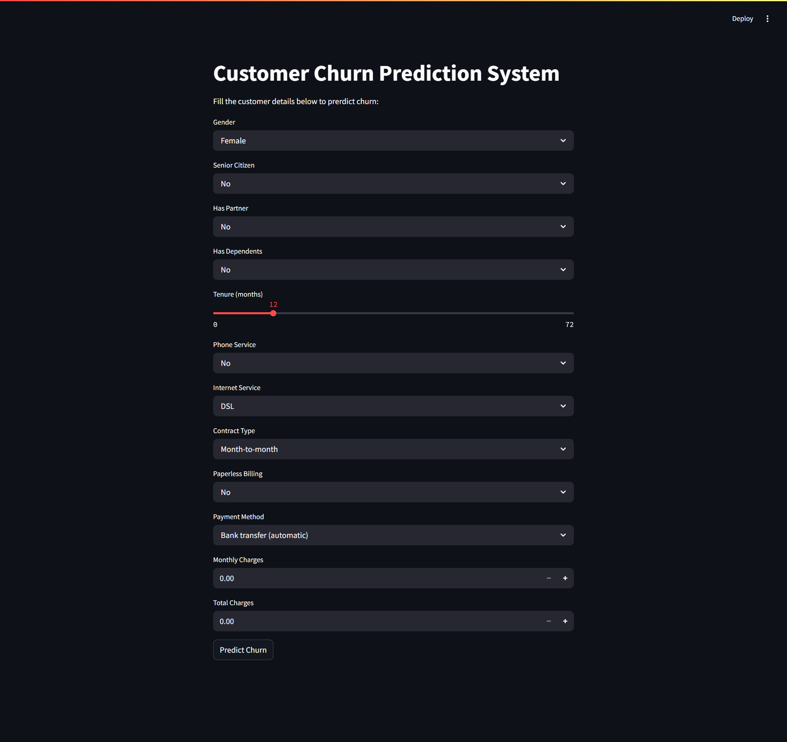

# 📚 Customer Churn Prediction System

This is a machine learning web app built with **Python** and **Streamlit** that predicts whether a telecom customer is likely to **churn** (leave the service).

It uses a trained **Random Forest model** and a user-friendly interface to make real-time predictions based on customer data.

---

## 🚀 Features

- ✅ Predict customer churn using a trained ML model  
- 🖌️ Interactive and clean Streamlit UI  
- 📈 Pie chart visual for prediction probability *(Coming Soon)*  
- 📁 Accepts manual input from sidebar form  
- 💾 Model saved using `joblib` and reused for fast prediction  

---

## 🛠️ Technologies Used

- Python  
- Pandas  
- Scikit-learn *(RandomForestClassifier)*  
- Streamlit  
- Pickle  

---

## 📸 Screenshots

### Web App Interface  


---

## 📂 Project Structure
churn-predictor/
├── app.py
├── screenshots
    └──ui.png
├── churn_model.pkl
├── encoders.pkl
├── features.pkl
├── WA_Fn-UseC_-Telco-Customer-Churn.csv
├── requirements.txt ✅
└── README.md
---

## ▶️ How to Run Locally

```bash
# 1. Clone the Repository
git clone https://github.com/AKSHAY355-a/churn-predictor.git
cd churn-predictor

# 2. Install dependencies
pip install -r requirements.txt

# 3. Run the app
streamlit run app.py
